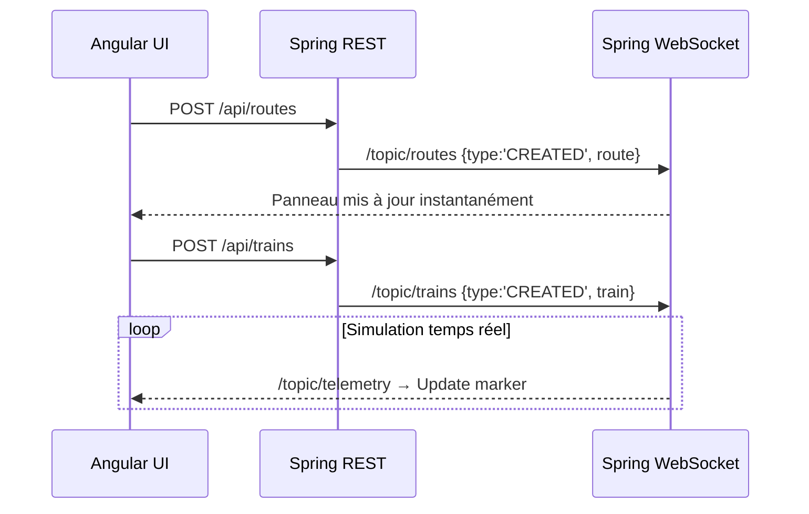

# 🚆 RailViz – Visualisation et Simulation Ferroviaire

## 📘 Description
**RailViz** est une application web temps réel permettant de **visualiser, simuler et gérer la circulation des trains sur des routes ferroviaires**.  
Elle est composée d’un **backend Spring Boot (Java)** et d’un **frontend Angular (TypeScript)** communiquant via **WebSockets (STOMP + SockJS)** et une **API REST**.

L’objectif du projet est de :
- Créer, visualiser et modifier des **routes ferroviaires**.
- Créer, suivre et gérer des **trains simulés en mouvement**.
- Offrir une **simulation cohérente de vitesse, freinage, accélération et signaux (rouge, jaune, vert)**.
- Fournir une **mise à jour instantanée (temps réel)** de tous les éléments grâce aux WebSockets.

---

## 🧱 Architecture du projet

```
RailViz/
│
├── Backend/railviz-backend/    # Projet Spring Boot
│   ├── src/main/java/com/railviz/
│   │   ├── controller/         # REST controllers (Routes, Trains)
│   │   ├── model/              # DTOs et classes métier
│   │   ├── service/            # Simulation, services, WebSocket, logique métier
│   │   └── config/             # Configuration WebSocket
│   └── pom.xml                 # Configuration Maven
│
└── Frontend/railviz-frontend/  # Projet Angular
    ├── src/app/
    │   ├── service/            # Services HTTP + WebSocket
    │   ├── components/         # Composants Angular (Map, Panels, etc.)
    │   ├── map.component.ts/html
    │   ├── routes-panel.component.ts/html
    │   └── trains-panel.component.ts/html
    ├── angular.json
    ├── package.json
    └── tsconfig.json
```

---

## ⚙️ Installation et Lancement

### 1️⃣ Backend – Spring Boot

#### 🔹 Prérequis
- Java 21+
- Maven 3.9+
- Spring Boot 3.3+
- (Optionnel) IDE : Eclipse / IntelliJ

#### 🔹 Étapes d’installation
```bash
cd backend
mvn clean install
mvn spring-boot:run
```

#### 🔹 Démarrage
Le backend démarre sur : `http://localhost:8080`

#### 🔹 Endpoints REST
| Méthode | Endpoint | Description |
|----------|-----------|-------------|
| `GET` | `/api/routes` | Liste des routes |
| `POST` | `/api/routes` | Création d’une route |
| `PUT` | `/api/routes/{id}` | Modification d’une route |
| `DELETE` | `/api/routes/{id}` | Suppression d’une route (interdite si train présent) |
| `GET` | `/api/trains` | Liste des trains |
| `POST` | `/api/trains` | Création d’un train |
| `PATCH` | `/api/trains/{id}` | Mise à jour de la vitesse ou route |
| `DELETE` | `/api/trains/{id}` | Suppression d’un train |

#### 🔹 Topics WebSocket
| Topic | Événement | Payload |
|--------|------------|----------|
| `/topic/telemetry` | Position en temps réel des trains | `TrainDTO` |
| `/topic/routes` | CRUD routes | `RouteWsEvent` |
| `/topic/trains` | CRUD trains | `TrainWsEvent` |

---

### 2️⃣ Frontend – Angular

#### 🔹 Prérequis
- Node.js 18+
- Angular CLI 17+
- npm ou yarn

#### 🔹 Installation
```bash
cd frontend
npm install
```

#### 🔹 Démarrage
```bash
npm start
```
ou
```bash
ng serve
```
L’application est disponible sur : `http://localhost:4200`

---

## 🧭 Fonctionnalités principales

### 🚆 Gestion des Trains
- Création d’un train (ID, route, vitesse, position de départ).
- Simulation automatique de mouvement : accélération, croisière, décélération.
- Mise à jour temps réel : vitesse, position GPS, signal, route.
- Suppression instantanée avec rafraîchissement automatique.

### 🛤️ Gestion des Routes
- Création par clics successifs sur la carte.
- Édition via éditeur JSON simple (ou modale à venir).
- Suppression interdite si un train circule dessus (409 Conflict).

### 🗺️ Carte interactive
- Routes colorées distinctement.
- Marqueurs des trains avec pastille signal (🟢🟡🔴).
- Panneaux latéraux (Routes à gauche, Trains à droite).
- Zoom automatique sur route/train.
- Filtrage des trains en alerte.

### ⚡ Temps réel (WebSockets)
Toutes les actions CRUD (routes, trains) se répercutent en direct sur la carte et les panneaux grâce à `/topic/routes`, `/topic/trains`, `/topic/telemetry`.

---

## 🧩 Technologies utilisées

### Backend
- Java 21, Spring Boot 3
- Spring Web, WebSocket (STOMP)
- Lombok, Maven

### Frontend
- Angular 17, TypeScript
- Leaflet (cartographie)
- RxJS, SockJS, STOMP
- HTML, SCSS

---

## 🧠 Simulation ferroviaire

Chaque train suit un cycle :
```
DÉPART (v=0, signal=RED)
 → Accélération (YELLOW)
 → Croisière (GREEN)
 → Décélération (YELLOW)
 → Arrêt (RED)
 → Pause → Demi-tour → Repart
```
Le calcul se base sur la longueur de la route (Haversine), la vitesse max et les accélérations/décélérations.

---

## 📡 Communication Backend ↔ Frontend



---

## 🚀 Améliorations futures
- Interface d’édition plus moderne (modales).
- Persistance DB (PostgreSQL).
- Authentification JWT.
- Export / import des données.
- Thème sombre.

---

## 👤 Auteur
**Teddy**  
Étudiant en ingénierie informatique passionné par les technologies Java / Angular et les simulations ferroviaires 🚄
